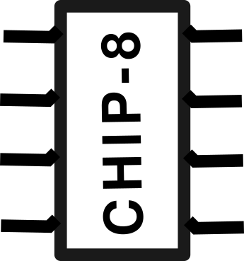

# CHIP-8 

    

## About
Chip8 is a virtual machine used during 1970s so that video game could easliy be developed among different computer architectures with different instruction set. here is more information [https://en.wikipedia.org/wiki/CHIP-8](https://en.wikipedia.org/wiki/CHIP-8)

## To run the program

- ` cd desktop `
- ` git clone https://github.com/voidash/CHIP-8`
- ` cd CHIP-8 `
- ` cd desktop `
- ` cargo run ../games/PONG2` 

## screenshot

pong2 

ufo  

## Features 

- 64x32 monochrome dispaly
- 16 : 8 bit general purspose registers.
- 16 bit program counter
- Single 16 bit register used as a pointer for memeory access. 
- 16 key keyboard input 

